<div align="center">

# 🍌 BananaDryer-IoT

### Smart Banana Slicing & Drying System


<br/>

[](#)
[](#)
[](#-lisensi)

<br/>


</div>

<br/>

## 📖 Tentang Proyek

**BananaDryer-IoT** adalah sistem mesin **pemotong dan pengering pisang otomatis** berbasis IoT, dikembangkan sebagai Proyek Akhir Program Studi D3 Teknologi Komputer, Institut Teknologi Del. Sistem ini mengintegrasikan **firmware embedded**, **gateway IoT**, **backend real-time**, dan **dashboard web** dalam satu arsitektur end-to-end — memungkinkan operator (UMKM/petani pisang) memantau dan mengendalikan proses pemotongan serta pengeringan pisang dari jarak jauh, secara real-time, melalui browser.

> 🎯 **Tujuan:** menggantikan proses pemotongan & penjemuran manual pisang dengan sistem otomatis yang presisi, terpantau, dan hemat waktu — cocok untuk skala UMKM.

<br/>

<div align="center">

</div>

<br/>

## 📑 Daftar Isi

<details open>
<summary>Klik untuk buka/tutup</summary>

- [Tentang Proyek](#-tentang-proyek)
- [Fitur Utama](#-fitur-utama)
- [Tampilan Sistem](#-tampilan-sistem)
- [Tampilan Halaman Aplikasi](#-tampilan-halaman-aplikasi)
- [Dokumentasi Perangkat Keras](#-dokumentasi-perangkat-keras)
- [Arsitektur Sistem](#-arsitektur-sistem)
- [Alur Data (Data Flow)](#-alur-data-data-flow)
- [Tech Stack](#-tech-stack)
- [Struktur Proyek](#-struktur-proyek)
- [Finite State Machine (FSM)](#-finite-state-machine-fsm-mesin-pemotong)
- [MQTT Topics](#-mqtt-topics)
- [REST API Endpoints](#-rest-api-endpoints)
- [Skema Database](#-skema-database)
- [Instalasi & Menjalankan Proyek](#-instalasi--menjalankan-proyek)
- [Environment Variables](#-environment-variables)
- [Roadmap](#-roadmap)
- [Tim Pengembang](#-tim-pengembang)
- [Lisensi](#-lisensi)

</details>

<br/>

## ✨ Fitur Utama

<table>
<tr>
<td width="50%" valign="top">

### 🔪 Modul Pemotong
- Mode **Otomatis** (siklus target) & **Manual** (kontrol langsung)
- Kontrol independen pendorong (TB1) & pisau (TB2)
- Preset jumlah siklus (5 / 10 / 15 / 20) + input custom
- Ilustrasi SVG posisi mekanik real-time
- Speedometer & grafik kecepatan motor live

</td>
<td width="50%" valign="top">

### 🔥 Modul Pengering
- Kontrol heater otomatis & manual
- Grafik suhu & kelembaban dengan **pita ideal (ideal band)**
- Auto-stop cerdas saat target tercapai lebih cepat
- Estimasi waktu vs progres real-time
- Notifikasi "target tercapai lebih awal"

</td>
</tr>
<tr>
<td width="50%" valign="top">

### 📊 Dashboard & Monitoring
- Layout bento-grid dengan status hero animasi
- Kesehatan sistem (WiFi RSSI, heap, uptime, firmware)
- Ringkasan sesi harian & log aktivitas real-time
- Riwayat sesi lengkap + detail per sesi
- Sistem alert (emergency stop, sensor error, dsb.)

</td>
<td width="50%" valign="top">

### ⚙️ Infrastruktur
- Komunikasi real-time via **Socket.IO**
- MQTT over TLS (**HiveMQ Cloud**)
- Auto-reconnect & watchdog device offline
- Emergency stop berbasis hardware interrupt
- Non-blocking FSM (`millis()`) di firmware Nano

</td>
</tr>
</table>

<br/>

## 🖼️ Tampilan Sistem

<div align="center">

**Dashboard Overview**

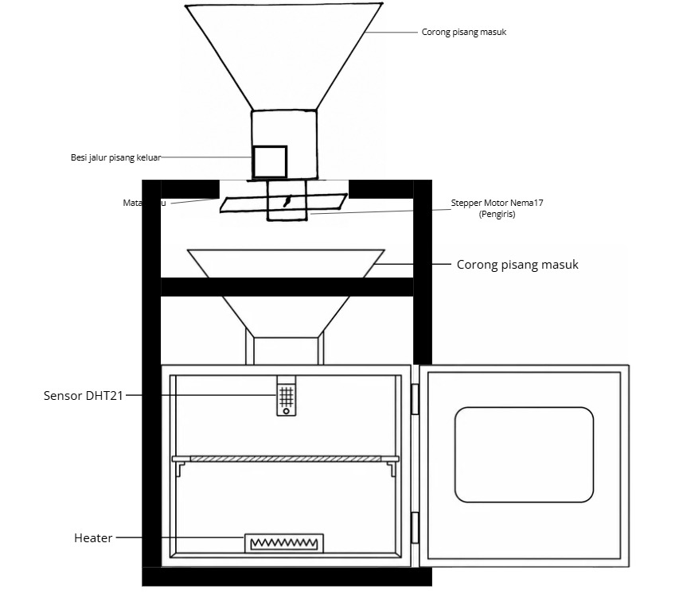

<br/><br/>

<table>
<tr>
<td align="center" width="25%">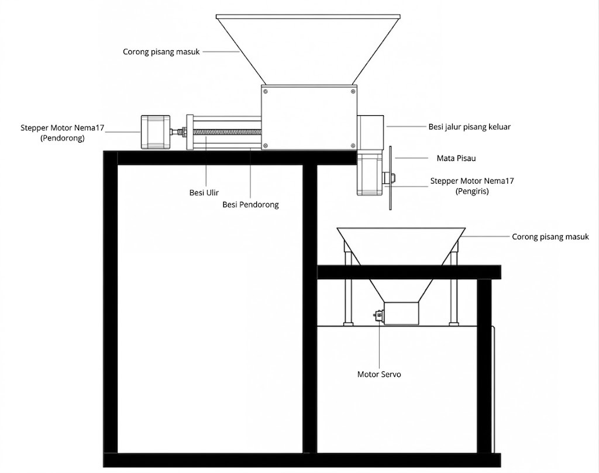<br/><sub><b>Tampak Kiri</b></sub></td>
<td align="center" width="25%"><br/><sub><b>Tampak Depan</b></sub></td>
<td align="center" width="25%">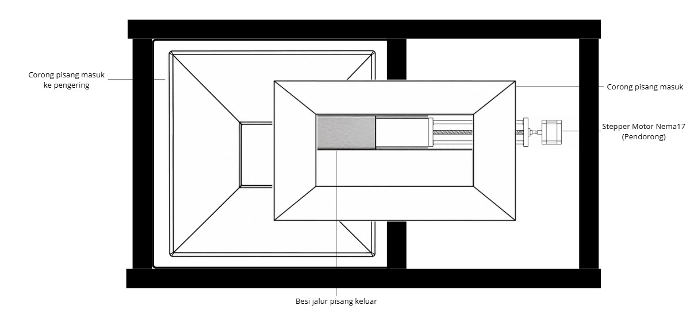<br/><sub><b>Tampak Atas</b></sub></td>
<td align="center" width="25%">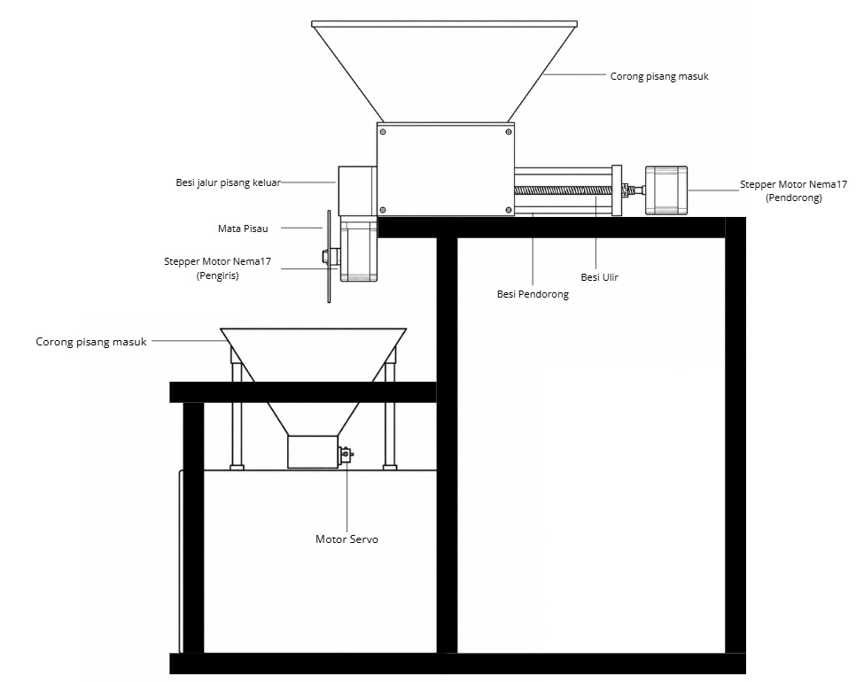<br/><sub><b>Tampak Kanan</b></sub></td>
</tr>
</table>

</div>

<br/>

## 📸 Tampilan Halaman Aplikasi

<div align="center">

<table>
<tr>
<td align="center" width="33%">
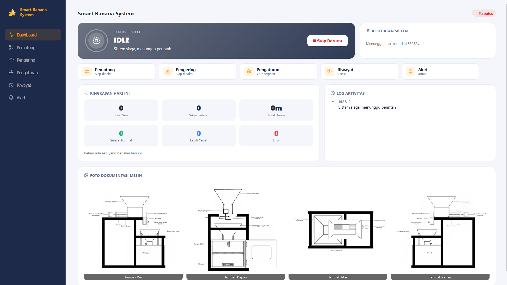
<br/><b>Dashboard</b>
</td>
<td align="center" width="33%">
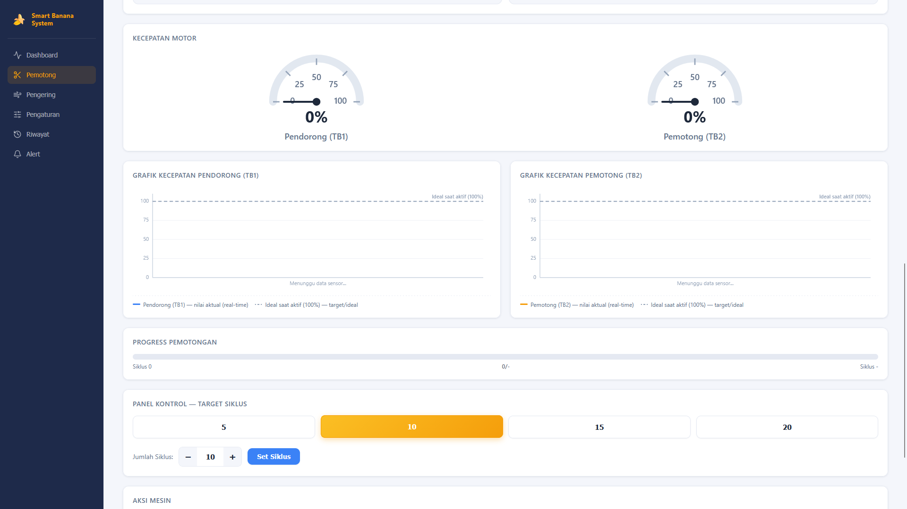
<br/><b>Pemotong</b>
</td>
<td align="center" width="33%">
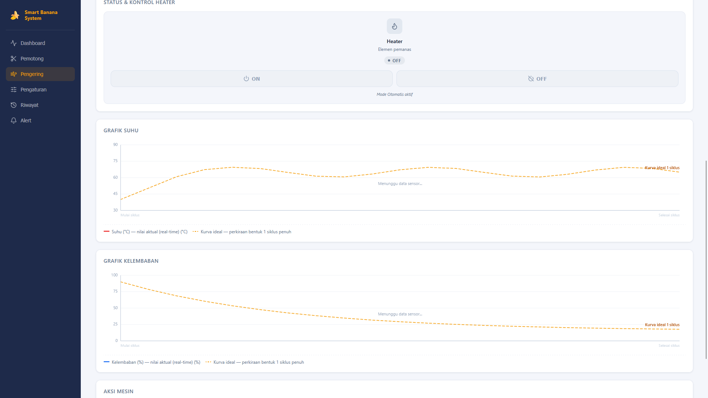
<br/><b>Pengering</b>
</td>
</tr>
<tr>
<td align="center" width="33%">
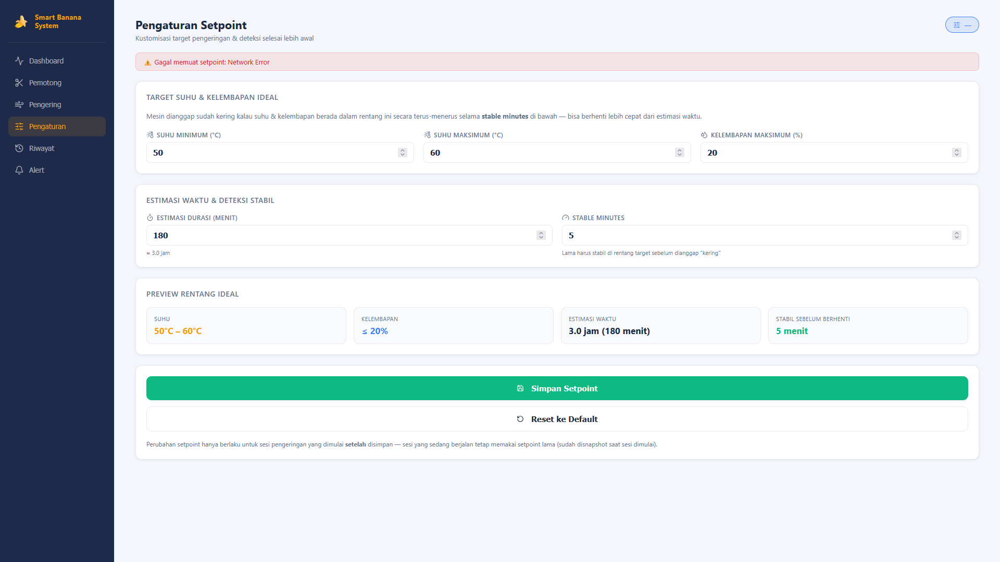
<br/><b>Pengaturan</b>
</td>
<td align="center" width="33%">
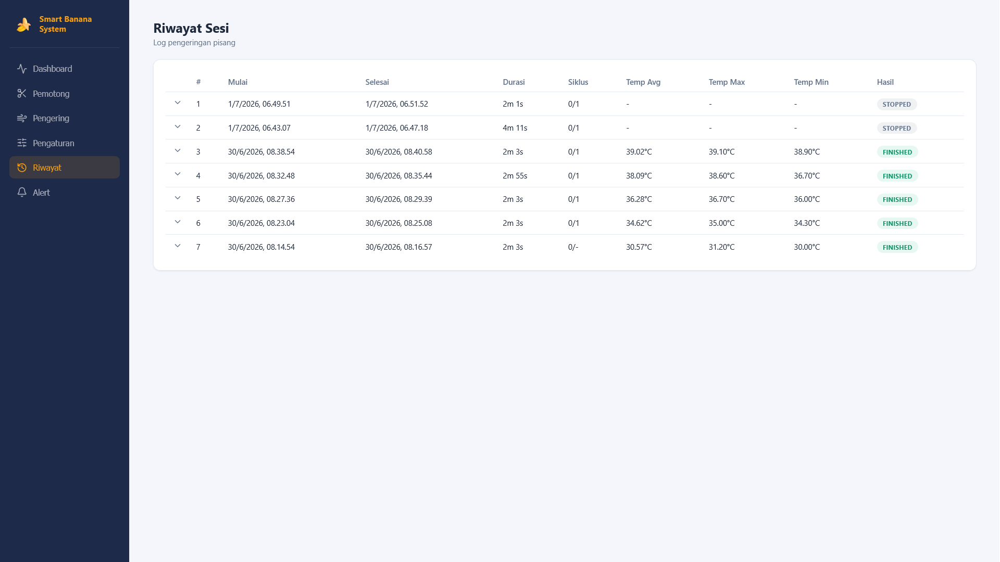
<br/><b>Riwayat</b>
</td>
<td align="center" width="33%">
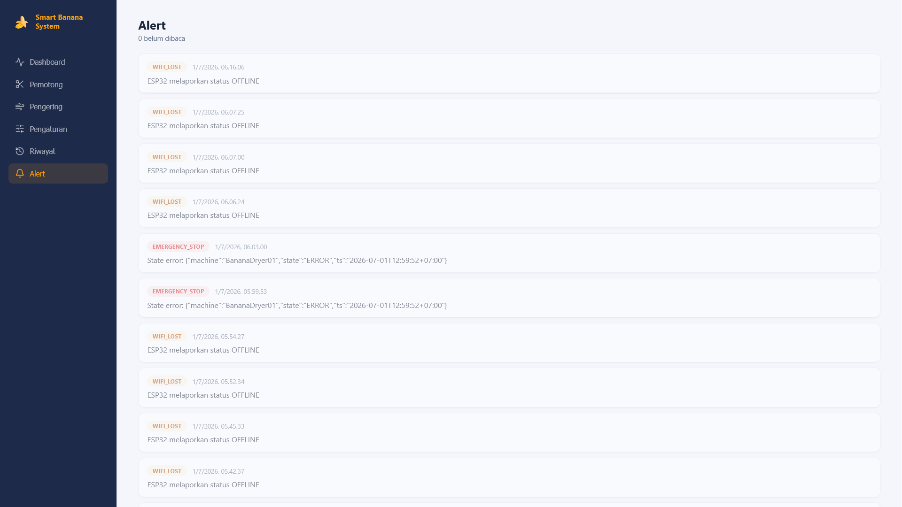
<br/><b>Alert</b>
</td>
</tr>
</table>

</div>

<br/>

## 🔧 Dokumentasi Perangkat Keras

<div align="center">

### Unit Pemotong / Pengiris

<table>
<tr>
<td align="center" width="25%">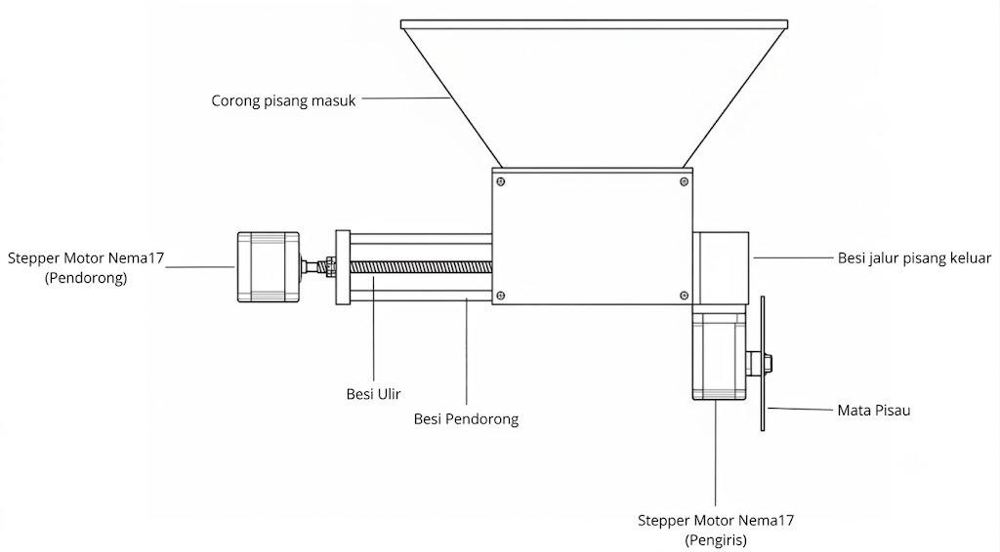<br/><sub>Kiri</sub></td>
<td align="center" width="25%">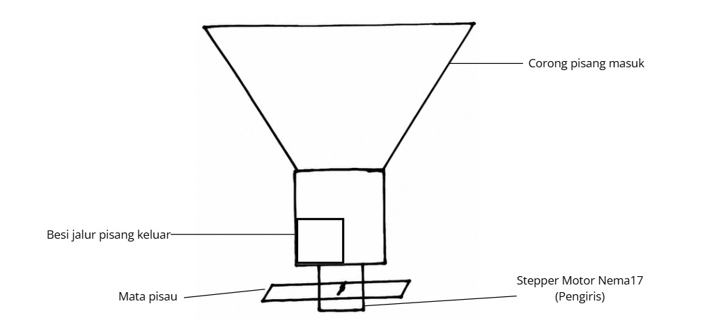<br/><sub>Depan</sub></td>
<td align="center" width="25%">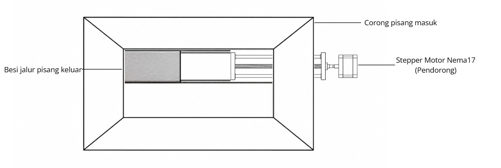<br/><sub>Atas</sub></td>
<td align="center" width="25%">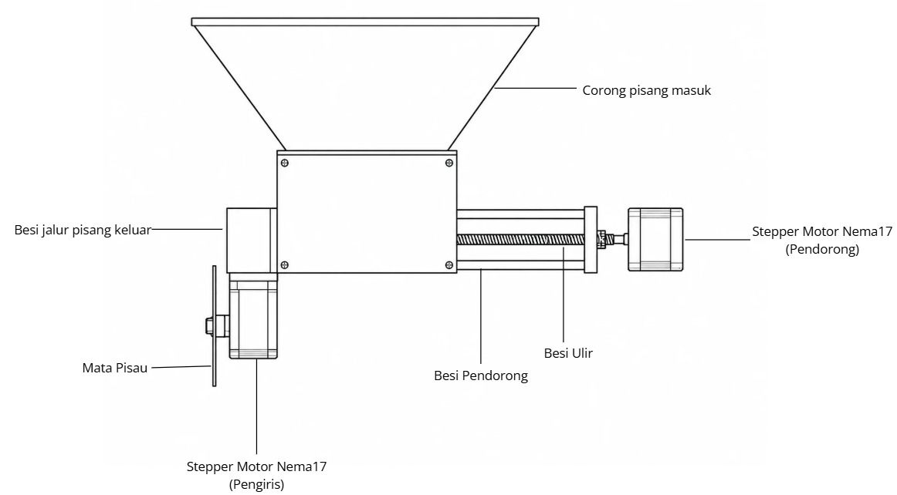<br/><sub>Kanan</sub></td>
</tr>
</table>

### Unit Pengering

<table>
<tr>
<td align="center" width="25%">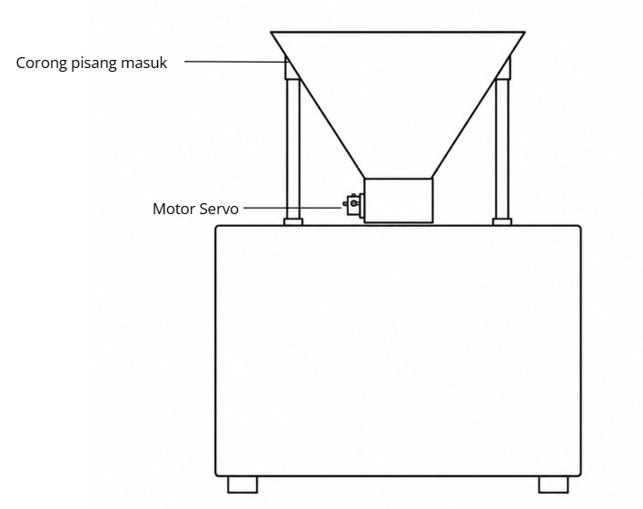<br/><sub>Kiri</sub></td>
<td align="center" width="25%">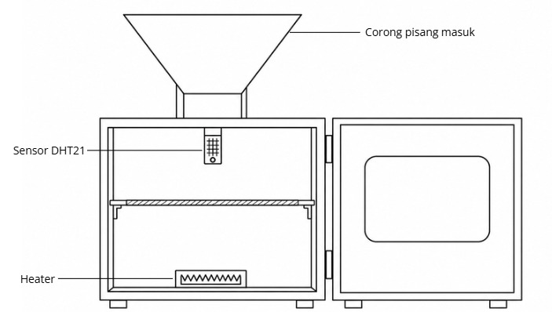<br/><sub>Depan</sub></td>
<td align="center" width="25%">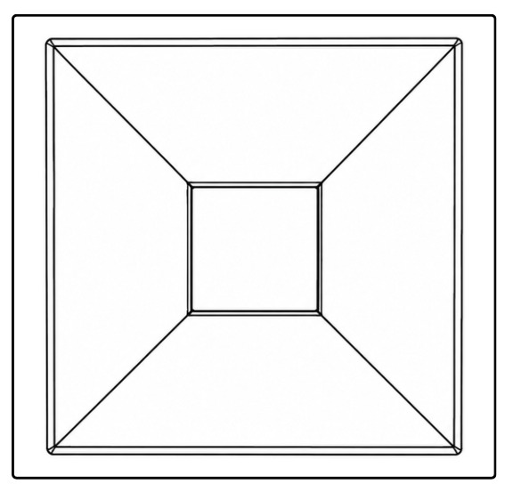<br/><sub>Atas</sub></td>
<td align="center" width="25%">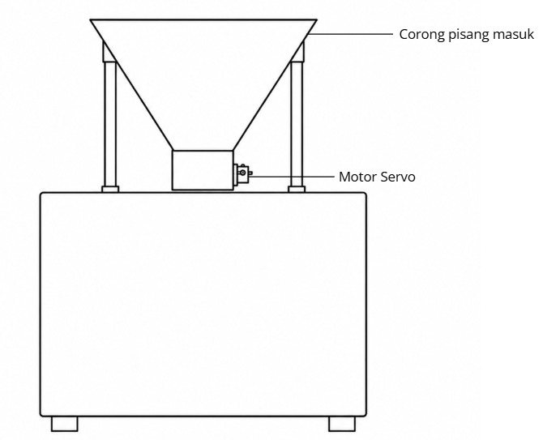<br/><sub>Kanan</sub></td>
</tr>
</table>

</div>

<br/>

## 🏗️ Arsitektur Sistem

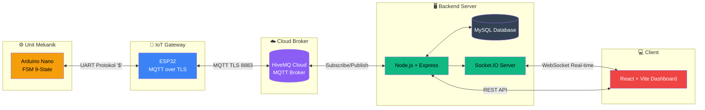
```mermaid
flowchart LR
    subgraph Mekanik["⚙️ Unit Mekanik"]
        A[Arduino Nano<br/>FSM 9-State]
    end

    subgraph Gateway["📡 IoT Gateway"]
        B[ESP32<br/>MQTT over TLS]
    end

    subgraph Cloud["☁️ Cloud Broker"]
        C[(HiveMQ Cloud<br/>MQTT Broker)]
    end

    subgraph Server["🖥️ Backend Server"]
        D[Node.js + Express]
        E[(MySQL Database)]
        F[Socket.IO Server]
    end

    subgraph Client["💻 Client"]
        G[React + Vite Dashboard]
    end

    A <-->|UART Protokol '$'| B
    B <-->|MQTT TLS 8883| C
    C <-->|Subscribe/Publish| D
    D <--> E
    D --> F
    F <-->|WebSocket Real-time| G
    D <-->|REST API| G

    style A fill:#f59e0b,color:#000
    style B fill:#3b82f6,color:#fff
    style C fill:#8b5cf6,color:#fff
    style D fill:#10b981,color:#000
    style E fill:#334155,color:#fff
    style F fill:#10b981,color:#000
    style G fill:#ef4444,color:#fff
```

<br/>

## 🔄 Alur Data (Data Flow)

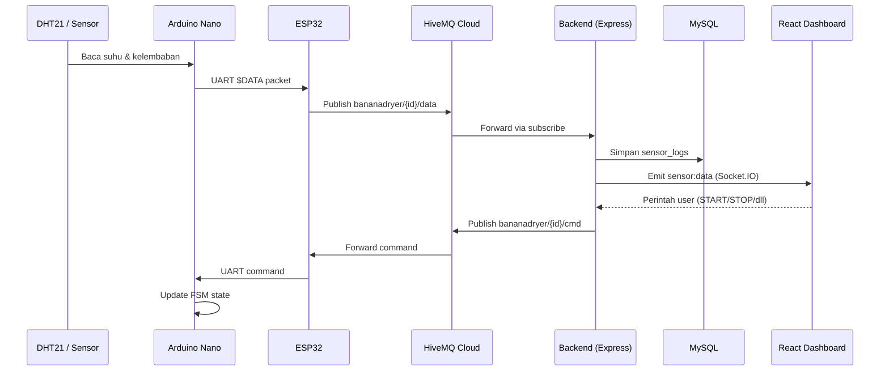
```mermaid
sequenceDiagram
    participant Sensor as DHT21 / Sensor
    participant Nano as Arduino Nano
    participant ESP as ESP32
    participant MQTT as HiveMQ Cloud
    participant BE as Backend (Express)
    participant DB as MySQL
    participant FE as React Dashboard

    Sensor->>Nano: Baca suhu & kelembaban
    Nano->>ESP: UART $DATA packet
    ESP->>MQTT: Publish bananadryer/{id}/data
    MQTT->>BE: Forward via subscribe
    BE->>DB: Simpan sensor_logs
    BE->>FE: Emit sensor:data (Socket.IO)
    FE-->>BE: Perintah user (START/STOP/dll)
    BE->>MQTT: Publish bananadryer/{id}/cmd
    MQTT->>ESP: Forward command
    ESP->>Nano: UART command
    Nano->>Nano: Update FSM state
```

<br/>

## 🧰 Tech Stack

<div align="center">

| Layer | Teknologi |
|---|---|
| **Firmware — Aktuator** | Arduino Nano · C++ · Non-blocking FSM (`millis()`) · Interrupt-based E-Stop |
| **Firmware — Gateway** | ESP32 · MQTT over TLS · Auto-reconnect · Heartbeat publisher |
| **Message Broker** | HiveMQ Cloud (MQTT, port 8883) |
| **Backend** | Node.js · Express · Socket.IO · mqtt.js · mysql2 |
| **Database** | MySQL |
| **Frontend** | React 19 · Vite · Recharts · Socket.IO-client · Axios · Lucide Icons |
| **Realtime** | Socket.IO (WebSocket) |

</div>

<br/>

## 📁 Struktur Proyek

```
BananaDryer-IoT/
├── arduino-nano/
│   └── nano.ino              # Firmware FSM 9-state (pendorong, pisau, servo, heater)
│
├── esp32/
│   └── esp32.ino             # Gateway MQTT TLS, heartbeat, auto-reconnect
│
├── backend/
│   ├── src/
│   │   ├── config/           # Koneksi database & MQTT
│   │   ├── controllers/      # Logic tiap endpoint (sensor, session, machine, alert, settings)
│   │   ├── routes/           # Definisi REST API
│   │   ├── services/         # mqttService — handler pesan MQTT → DB → Socket.IO
│   │   ├── socket/           # Socket.IO server
│   │   ├── models/           # migrate.js — skema & seed database
│   │   ├── app.js
│   │   └── server.js
│   └── package.json
│
└── frontend/
    ├── src/
    │   ├── assets/            # Foto dokumentasi mesin
    │   │   ├── pemotong/
    │   │   └── pengering/
    │   ├── components/        # Sidebar, Speedometer, DualLineChart, ManualControl, dst.
    │   ├── hooks/              # useSocket.js, api.js
    │   ├── pages/               # Dashboard, Pemotong, Pengering, Settings, History, Alerts
    │   ├── App.jsx
    │   └── index.css
    └── package.json
```

<br/>

## 🔁 Finite State Machine (FSM) — Mesin Pemotong

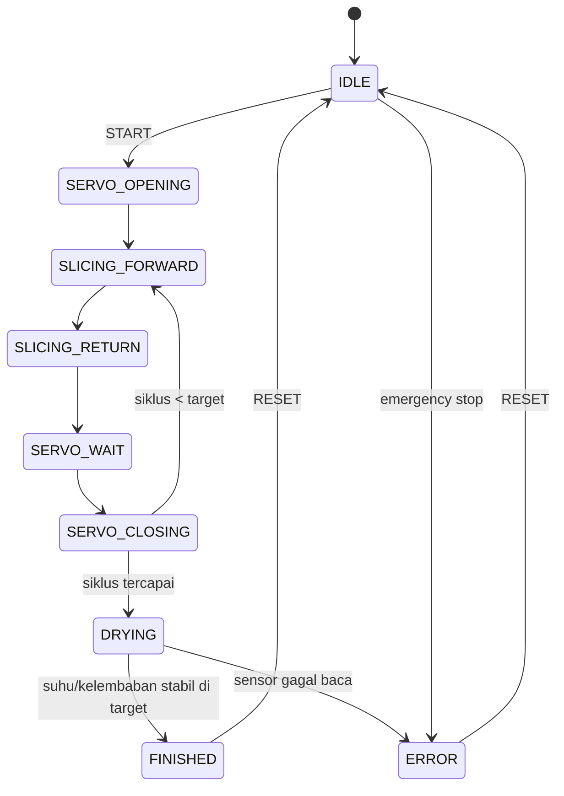
```mermaid
stateDiagram-v2
    [*] --> IDLE
    IDLE --> SERVO_OPENING: START
    SERVO_OPENING --> SLICING_FORWARD
    SLICING_FORWARD --> SLICING_RETURN
    SLICING_RETURN --> SERVO_WAIT
    SERVO_WAIT --> SERVO_CLOSING
    SERVO_CLOSING --> SLICING_FORWARD: siklus < target
    SERVO_CLOSING --> DRYING: siklus tercapai
    DRYING --> FINISHED: suhu/kelembaban stabil di target
    DRYING --> ERROR: sensor gagal baca
    FINISHED --> IDLE: RESET
    ERROR --> IDLE: RESET
    IDLE --> ERROR: emergency stop
```

Firmware Arduino Nano mengelola FSM ini secara **non-blocking** menggunakan `millis()`, sehingga pembacaan sensor DHT21 dan penanganan hardware-interrupt untuk emergency stop tetap responsif walau motor sedang bergerak.

<br/>

## 📡 MQTT Topics

Seluruh komunikasi antara ESP32 dan backend berjalan di atas broker **HiveMQ Cloud** dengan pola topic berikut (`{machine_id}` = ID mesin, default `BananaDryer01`):

| Topic | Arah | Deskripsi |
|---|---|---|
| `bananadryer/{machine_id}/data` | ESP32 → Backend | Data sensor (suhu, kelembaban, progress, siklus, status aktuator) |
| `bananadryer/{machine_id}/state` | ESP32 → Backend | Perubahan state FSM |
| `bananadryer/{machine_id}/status` | ESP32 → Backend | Status koneksi ESP32 (ONLINE/OFFLINE, via LWT) |
| `bananadryer/{machine_id}/heartbeat` | ESP32 → Backend | Firmware, RSSI, heap free, uptime, status Nano |
| `bananadryer/{machine_id}/cmd` | Backend → ESP32 | Perintah kontrol (START, STOP, RESET, CYCLES, HEATER, PUSHER, CUTTER) |

<br/>

## 🔌 REST API Endpoints

<details>
<summary><b>📍 Sensor</b> — <code>/api/sensor</code></summary>
<br/>

| Method | Endpoint | Deskripsi |
|---|---|---|
| `GET` | `/api/sensor/latest` | Data sensor terbaru |
| `GET` | `/api/sensor/history` | Histori data sensor |
| `GET` | `/api/sensor/summary` | Ringkasan statistik sensor |

</details>

<details>
<summary><b>📍 Session</b> — <code>/api/session</code></summary>
<br/>

| Method | Endpoint | Deskripsi |
|---|---|---|
| `GET` | `/api/session` | Daftar seluruh sesi |
| `GET` | `/api/session/:id` | Detail satu sesi |
| `GET` | `/api/session/:id/sensor` | Data sensor dalam rentang satu sesi |

</details>

<details>
<summary><b>📍 Machine</b> — <code>/api/machine</code></summary>
<br/>

| Method | Endpoint | Deskripsi |
|---|---|---|
| `GET` | `/api/machine/:machineId/status` | Status mesin |
| `POST` | `/api/machine/:machineId/start` | Mulai siklus otomatis |
| `POST` | `/api/machine/:machineId/stop` | Hentikan mesin |
| `POST` | `/api/machine/:machineId/reset` | Reset sistem |
| `POST` | `/api/machine/:machineId/cycles` | Atur jumlah target siklus |
| `POST` | `/api/machine/:machineId/heater` | Kontrol manual heater (ON/OFF) |
| `POST` | `/api/machine/:machineId/pusher` | Kontrol manual pendorong |
| `POST` | `/api/machine/:machineId/cutter` | Kontrol manual pisau |

</details>

<details>
<summary><b>📍 Alerts</b> — <code>/api/alerts</code></summary>
<br/>

| Method | Endpoint | Deskripsi |
|---|---|---|
| `GET` | `/api/alerts` | Daftar alert |
| `PATCH` | `/api/alerts/ack-all` | Tandai semua alert sudah dibaca |
| `PATCH` | `/api/alerts/:id/ack` | Tandai satu alert sudah dibaca |

</details>

<details>
<summary><b>📍 Settings</b> — <code>/api/settings</code></summary>
<br/>

| Method | Endpoint | Deskripsi |
|---|---|---|
| `GET` | `/api/settings` | Ambil setpoint (target suhu, kelembaban, estimasi durasi) |
| `PUT` | `/api/settings` | Perbarui setpoint |

</details>

<details>
<summary><b>📍 Health Check</b></summary>
<br/>

| Method | Endpoint | Deskripsi |
|---|---|---|
| `GET` | `/api/health` | Status server & uptime |

</details>

<br/>

## 🗄️ Skema Database

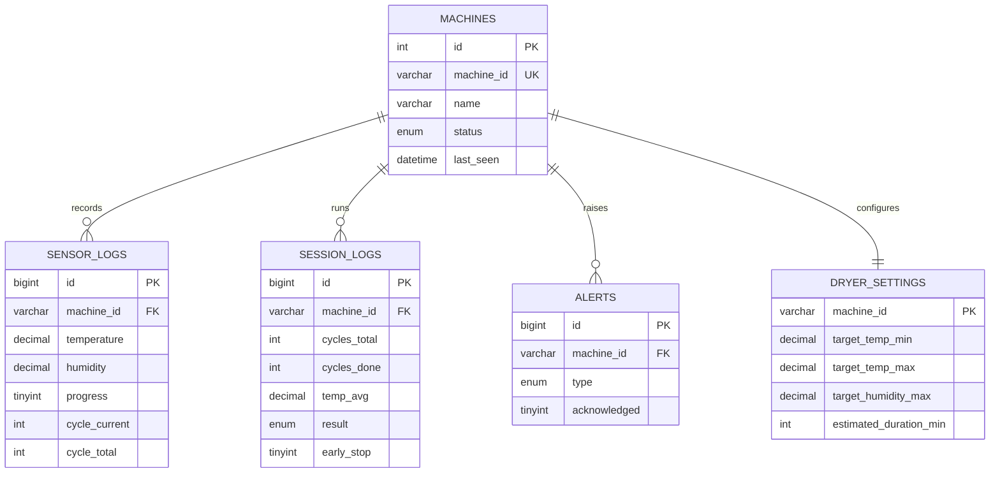
```mermaid
erDiagram
    MACHINES ||--o{ SENSOR_LOGS : records
    MACHINES ||--o{ SESSION_LOGS : runs
    MACHINES ||--o{ ALERTS : raises
    MACHINES ||--|| DRYER_SETTINGS : configures

    MACHINES {
        int id PK
        varchar machine_id UK
        varchar name
        enum status
        datetime last_seen
    }
    SENSOR_LOGS {
        bigint id PK
        varchar machine_id FK
        decimal temperature
        decimal humidity
        tinyint progress
        int cycle_current
        int cycle_total
    }
    SESSION_LOGS {
        bigint id PK
        varchar machine_id FK
        int cycles_total
        int cycles_done
        decimal temp_avg
        enum result
        tinyint early_stop
    }
    ALERTS {
        bigint id PK
        varchar machine_id FK
        enum type
        tinyint acknowledged
    }
    DRYER_SETTINGS {
        varchar machine_id PK
        decimal target_temp_min
        decimal target_temp_max
        decimal target_humidity_max
        int estimated_duration_min
    }
```

<br/>

## 🚀 Instalasi & Menjalankan Proyek

### Prasyarat


- Node.js ≥ 18
- MySQL Server ≥ 8.0
- Arduino IDE (dengan board package ESP32 & library `DHT`, `Servo`)
- Akun broker MQTT (contoh: HiveMQ Cloud, gratis untuk tier kecil)

### 1️⃣ Clone repository

```bash
git clone https://github.com/angelinozulianohutapea/BananaDryer-IoT.git
cd BananaDryer-IoT
```

### 2️⃣ Setup Backend

```bash
cd backend
npm install
cp .env.example .env    # lalu isi kredensial MySQL & MQTT kamu sendiri
npm run migrate         # buat tabel & seed data awal
npm run dev              # jalankan server (default: http://localhost:3000)
```

### 3️⃣ Setup Frontend

```bash
cd frontend
npm install
cp .env.example .env    # isi VITE_BACKEND_URL
npm run dev              # jalankan dashboard (default: http://localhost:5173)
```

### 4️⃣ Flash Firmware

| Board | File | Catatan |
|---|---|---|
| Arduino Nano | `arduino-nano/nano.ino` | Sesuaikan pin motor, servo, DHT21 sebelum upload |
| ESP32 | `esp32/esp32.ino` | Isi kredensial WiFi & MQTT broker sebelum upload |

> ⚠️ Pastikan `MACHINE_ID` di backend `.env` **sama persis** dengan ID yang dipakai ESP32 agar topic MQTT cocok.

<br/>

## 🔐 Environment Variables

<details>
<summary><b>backend/.env</b></summary>
<br/>

```env
# ── Server ──────────────────────────────────────────────────
PORT=3000

# ── MySQL ────────────────────────────────────────────────────
DB_HOST=localhost
DB_PORT=3306
DB_USER=your_db_user
DB_PASSWORD=your_db_password
DB_NAME=bananadryer

# ── MQTT ─────────────────────────────────────────────────────
MQTT_HOST=your-cluster.s1.eu.hivemq.cloud
MQTT_PORT=8883
MQTT_USERNAME=your_mqtt_username
MQTT_PASSWORD=your_mqtt_password
MQTT_CLIENT_ID=bananadryer-backend-01

# ── Machine ID ───────────────────────────────────────────────
MACHINE_ID=BananaDryer01
```

</details>

<details>
<summary><b>frontend/.env</b></summary>
<br/>

```env
VITE_BACKEND_URL=http://localhost:3000
```

</details>

> 🔒 **Jangan pernah commit file `.env` asli ke repository.** Gunakan `.env.example` sebagai template dan pastikan `.env` sudah masuk `.gitignore`.

<br/>

## 🗺️ Roadmap

- [x] Firmware FSM Arduino Nano (v2.0 → v2.4)
- [x] ESP32 MQTT Gateway dengan TLS & auto-reconnect
- [x] Backend REST API + Socket.IO real-time
- [x] Dashboard React (Dashboard, Pemotong, Pengering, Settings, History, Alerts)
- [x] Migrasi tampilan ke light theme

<br/>

## 👥 Tim Pengembang

<div align="center">

Proyek Akhir — **D3 Teknologi Komputer, Institut Teknologi Del**

| Peran | Cakupan |
|---|---|
| Firmware & Embedded | Arduino Nano FSM, ESP32 Gateway |
| Backend & Database | Node.js, Express, MQTT Service, MySQL |
| Frontend & UI/UX | React Dashboard, Realtime Visualization |

</div>

<br/>

## 📜 Lisensi

Proyek ini dibuat untuk keperluan akademik (Proyek Akhir) di Institut Teknologi Del. Silakan gunakan sebagai referensi pembelajaran dengan tetap mencantumkan atribusi.

<br/>

<div align="center">

### ⭐ Kalau proyek ini membantu, jangan lupa kasih bintang!

🍌 **BananaDryer-IoT** — Institut Teknologi Del

</div>
